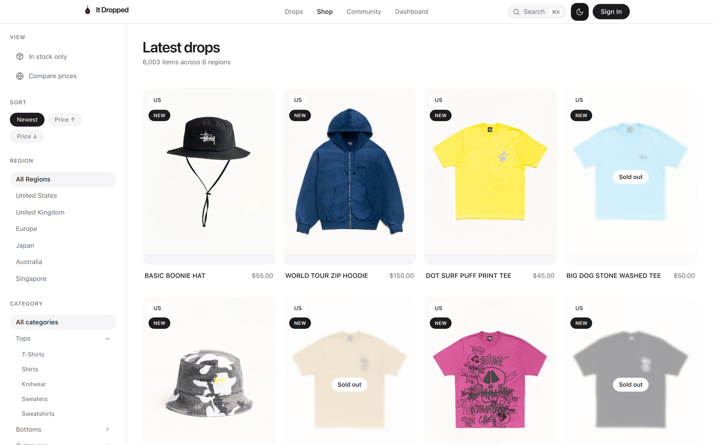
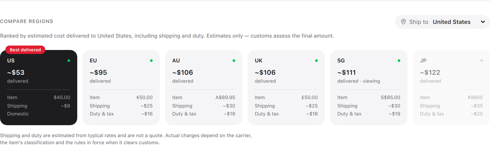
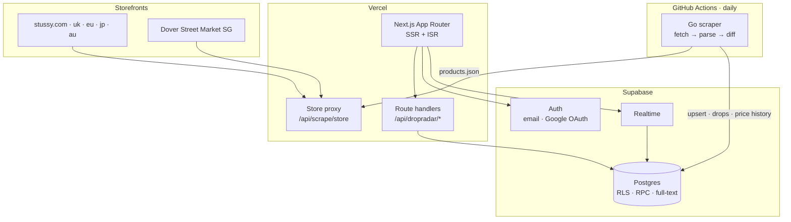

<div align="center">

# It Dropped

**Track Stüssy across six storefronts and find out where a garment is actually cheapest — after shipping and duty.**

[](https://it-dropped.vercel.app)


</div>



---

## The problem

Stüssy sells the same garment through six storefronts in five currencies, and each prices independently. A tee is $45 in the US and S$85 in Singapore. Which is cheaper depends on where you live, because shipping and duty are often larger than the price gap.

Worse, the stores don't agree on how to identify a product. Stüssy's own sites use one SKU convention; Dover Street Market Singapore uses its own. Matching a garment across regions is the hard part, and everything else depends on it.

## What it does

**Compares the delivered cost, not the sticker price.** Every regional listing of the same garment, ranked by what it would actually cost to get to your door.



- **Six storefronts** — US, UK, EU, JP, AU, and Dover Street Market Singapore, which carries pieces the brand's own stores don't
- **Cross-region identity** — resolves a `style_code` per garment, so the same hoodie is recognisable across five currencies
- **Landed cost** — shipping and duty estimated per corridor, so the ranking reflects reality rather than the price tag
- **Drop feed** — new listings, restocks, price cuts and sell-outs, found by diffing each scrape against the last
- **Alerts** — watch a price, a size, or a garment that isn't stocked in your country yet
- **Full-text search** — Postgres `tsvector` with weighted ranking over title, vendor, type and tags

## Architecture

Two hosted platforms and a scheduled job. No server to run.



**The scraper** runs once a day in CI. It fetches each store's `products.json`, parses variants into a normalised product, and diffs against a stored hash to decide what changed. Only changed rows are then read in full — the cheap fingerprint comparison comes first, which keeps a cycle inside Supabase's free egress allowance.

It fetches through Vercel rather than directly, because the stores answer a GitHub Actions runner's address `429` on the first request of a run, before it has asked for anything. That is a fact about the address — GitHub's egress ranges are shared and heavily abused — and no amount of backoff addresses it. So the fetch happens somewhere with a clean address and everything else stays in CI.

**The read API** is Next.js route handlers reading Supabase directly. There is no separate API service. The queries PostgREST can't express — ranked search, the handle-to-style-code resolution, the dashboard aggregates — live in Postgres as functions and views.

**Security** is row level security throughout. The catalogue is world-readable and writable only by `service_role`; every user-owned table is scoped to its owner. The publishable key in the browser bundle can read the catalogue and nothing else.

## Tech stack

| Layer | Choice | Why |
|---|---|---|
| Frontend | Next.js 14 (App Router), React 19, TypeScript | Server components for SEO, client components where interaction lives |
| Styling | Tailwind CSS, Radix UI primitives | Utility styling over accessible unstyled components |
| Charts | Recharts | Price history and dashboard aggregates |
| Database | Supabase Postgres | RLS, PostgREST, realtime and auth in one managed instance |
| Auth | Supabase Auth — email and Google OAuth, PKCE | Sessions in cookies, so server components can read them |
| Scraper | Go 1.24, `pgx` | Concurrent per-region fetches; a batch job, not a service |
| Notifications | Telegram Bot API | Optional — drops are recorded whether or not it is configured |
| Hosting | Vercel + GitHub Actions | Free at hobby scale, with nothing long-running to host |

## Repository layout

```
backend/
  cmd/scraper          the daily batch job
  cmd/bot              Telegram bot (optional)
  internal/scraper     fetching, parsing, the differ
  internal/database    queries and upserts
frontend/
  app/                 App Router pages
  app/api/dropradar    the read API, as route handlers
  lib/                 Supabase clients, landed-cost model, contexts
  components/          UI and feature components
docs/
  schema.sql           base schema
  migrations/          ordered and numbered, each runnable on its own
  DEPLOY.md            Vercel, Supabase and CI setup
  API.md               the read endpoints
infra/                 Kubernetes manifests, kept for reference
```

## Running it locally

```bash
# 1. Database — apply the schema, then every migration in order
psql "$DATABASE_URL" -f docs/schema.sql
for m in docs/migrations/*.sql; do psql "$DATABASE_URL" -f "$m"; done

# 2. Frontend
cd frontend
cp .env.example .env.local     # add your Supabase URL and publishable key
npm ci && npm run dev

# 3. One scrape cycle
cd backend
DATABASE_URL=… REGIONS=us,uk,eu,jp,au,sg SCRAPE_INTERVAL=0 go run ./cmd/scraper
```

`SCRAPE_INTERVAL=0` runs a single cycle and exits, which is what CI wants. Any positive value runs an internal loop instead — useful locally, wrong under a scheduler, because the job never ends and the next run is skipped.

Deployment, including Google OAuth and the CI secret, is in [`docs/DEPLOY.md`](docs/DEPLOY.md).

## Notes on the data

Prices are what each storefront published at the last scrape. Shipping and duty are **estimates from typical rates for the corridor** — not a quote, and customs assesses the final amount. Currency conversion exists to make listings comparable on one axis, never to quote a checkout price.

## Licence

MIT — see [LICENSE](LICENSE).
